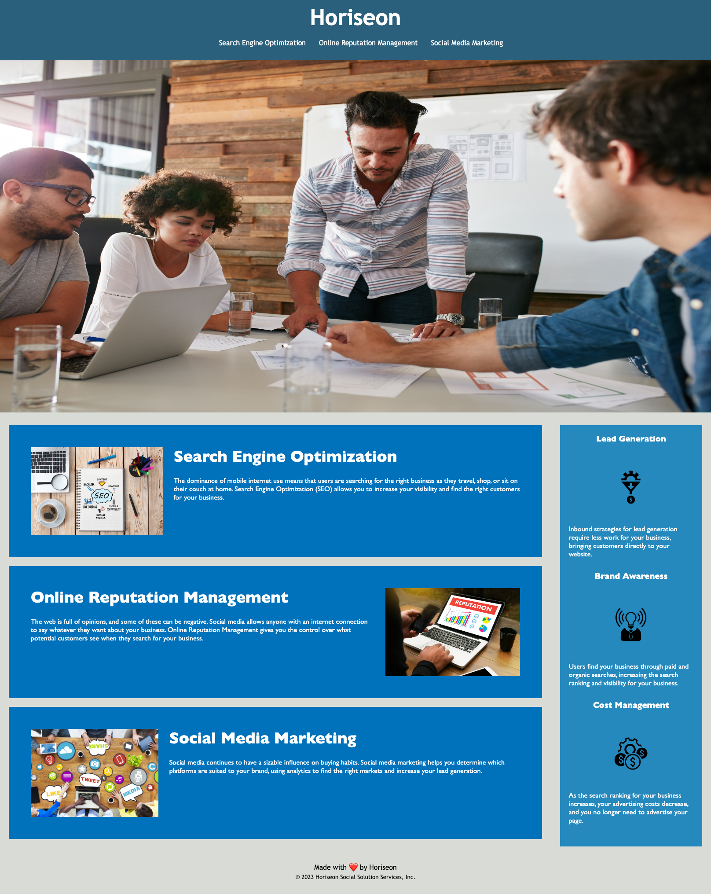

# Horiseon-accessibility

## Description 

My motivation for this project was to understand the general html structure, its relationship with CSS, and the type of typical selectors i'll see throughout my career. This project was built as a novice reference guide for future assignments or projects while also being utilized as an excerise to clean up old code for today's standards. Overall, this project taught me the importance of semantic elements, clean-consice coding, and the additon of accessible alt attributes for screen readers.

## Deploy app

[Deploy Application][def]

[def]: https://nicoinlalaland.github.io/horiseon-accessibility/